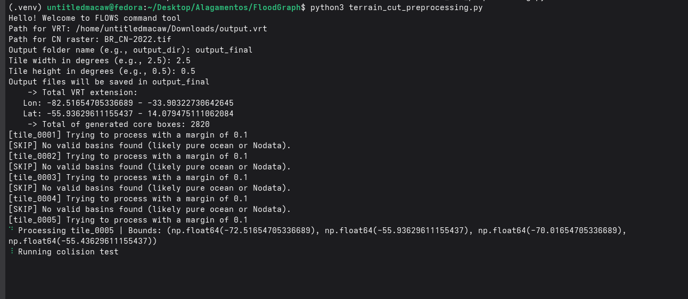
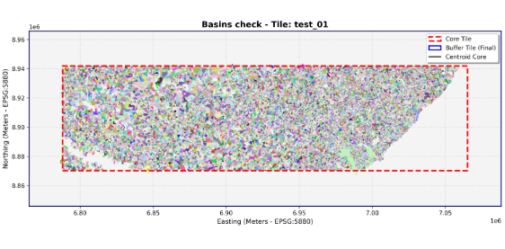
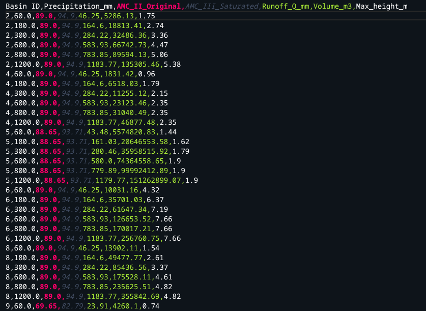

# FLOWS
(Flood Risk Likelihood from pre-compiled Watershed Analysis)

** A python tool for generating and evaluating flood-risk data without relying on constant hydrodynamic simulation and high-end hardware **

## About
Rather than dealing with complex hydrodynamic models, FLOWS analyses the terrain and finds bowl-like depressions - where water
tends to accumulate in the terrain - and their contributing areas (where rainwater flows down until it gets trapped in a respective
bowl-like depression) so it can analyses them. Why is that good: For a fixed ammount n of rainfall (in mm), the maximum height that water will reach in a respective  bowl-like depression + 
contribuiting area (let's call this union a "basin") will stay the same. This means that we can take basins and simulate beforehand various rainfall and antecedent soi moisture scenarios
and store those values so we can simply acess them later - thus saving up a lot of computational power.

## How it works

FLOWS finds basins (bowl-like depressions + contributing areas) and for each one finds or stores:

- Area
- Water height for each rainfall and soil moisture scenarios
- Geographical positioning (so we can actually now where basins are in the map)
- Composite Curve Number (for rainfall infiltration)

> IMPORTANT NOTE: The SCS Curve Number method can be faulty on some certain types of terrain, and therefore data needs ajustments before it can be safely used with it. Be aware when using this tool for your specific region. For the authors needs (Brazilian territory), ajustments and notes were used from: Sartori et al (2005).

For actually finding basins without exceeding RAM usage limits, FLOWS cuts the entire dataset into multiple analysis boxes (core boxes), and for each one:

1. Inserts a initial small buffer of surounding terrain
2. Runs WhiteboxTools to identify basins within the total boundaries (initial core box boundaries + buffer)
3. Runs a colision test where it checks whether any basins that belong to the core box touches the edge (defined by the total boundaries)
4. If a basin touches the edge, that indicates an incorrect cut, so we increase the buffer and go back to step 2
5. If not, we save our results (making sure we will be free from boundary artifacts)
6. We will keep increasing the edge until a safety limit (so the computer doesn't crash)

> For checking whether a basin belongs in a respective core box, we compare its centroid (from the 2D top-down view) and check if it is contained within the initial core box boundaries (excluding buffer). Since the centroid is unique, we make sure that basins are counted once.

## Usage and requirements
The FLOWS command tool can be found on the `terrain_cut_preprocessing.py` file (other alternatives exists for backup purpuses).
FLOWS will ask you to input:
- Path for VRT (must be in EPSG:4326 coordinates system, so far no other systems are supported. Make sure to convert your dataset before proceeding)
- Path for Curve Number raster (must also be in EPSG:4326 coordinates system) containing CN values for each pixel.
- A folder for storing output

It will return:
- A .csv table containing water height data from scenario from each basin from each core box
- A geopackage file (.gpkg) that serves as a map of where all of our basins are in the real world
- A bunch of images from individual core boxes showing how basin finding turned out visually

Here is an image of the .csv table after a test:

As of requirements, Python 3.14 is used and all libraries can be found in requirements.txt, and can be installed with pip by running:
`pip install requirements.txt`

## Acknowledgements
FLOWS development heavily depended on:
- Brazil's National Water and Basic Sanitation Agency, that not only provided a DEM with reduced vegetation bias and a CN raster but also answered my emails and explained doubts!
- Python: Main programming language
- GDAL (`gdalbuildvrt`): Creating our virtual raster mosaic so we don't have to merge our dataset (that was provided in tiles. If your datas>
- WhiteboxTools: Terrain analysis for finding basins (pit breaching, D8 pointer, sink, and other fancy geographical tools).
- rasterio: Raster (.tif) reading/writing
- geopandas / shapely: Geometry handling and cordinates reprojection
- NumPy / SciPy: Masking (removing unwanted basins), centroid calculation and array stuff.
- Matplotlib: Visual diagnostics

and many other libaries that were of big importance to the project.

## AI usage
AI was used for learnning how to use WhiteboxTools and debugging / verifying code and its output
AI did not develop the project from scratch based on a "please do something that does that" prompt, neither it developed the main idea of finding bowl-like depressions and finding them.

## License
This project is licensed user the [MIT License](LICENCE).

## Author

Thiago Borges aka UntitledMacaw

*Note: this is a work-in-progress project, built by an enthusiast for study and experimentation in low-cost computational hydrology. Take that in consideration when applying it to your specific use case*
